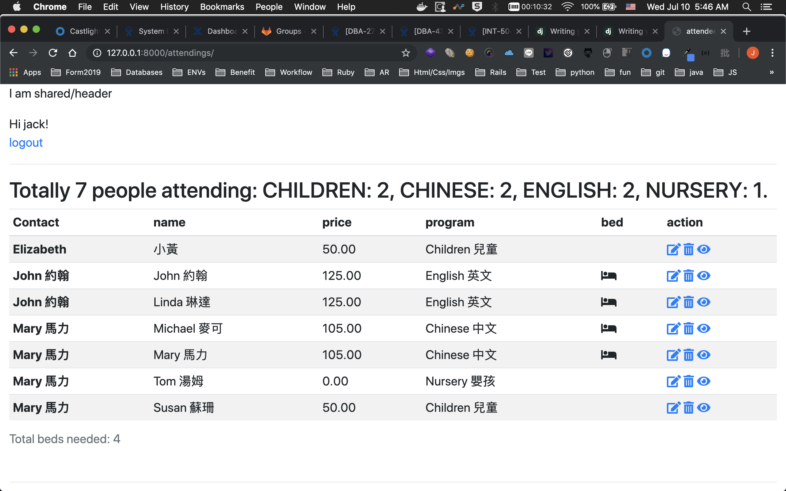

# attendee

## How to start

* clone the repo
* check local versions, it is developed with Python 3.7.3 and Django 2.2 
* ensure your local mysql server (>= 5.6) is running.
* edit DATABASES attendee/settings.py, especially USER and PASSWORD.
* Prepare database, default database name in DATABASES['default']['NAME'] is attendee_development
* python manage.py migrate
* python manage.py createsuperuser
* python manage.py runserver
